# NAV / Business Central Instructions

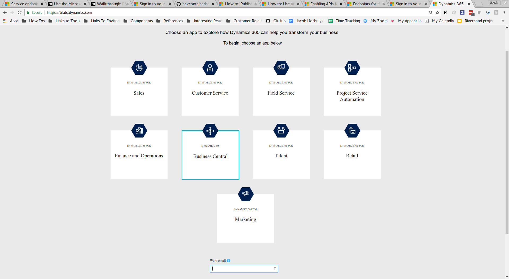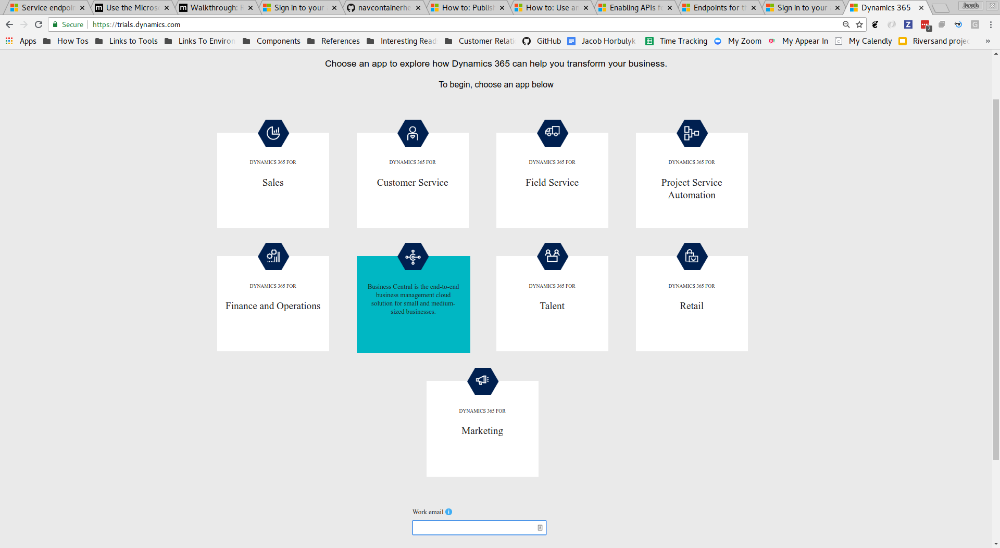

Microsoft Dynamics NAV is a product in the Microsoft Dynamics family.  It is an
ERP within that product family.  It has recently been renamed to **Business
Central**  and is often associated with the following logo.

## OData API Summary

Like other members of the Dynamics product family, Business Central exposes
[OData APIs](http://www.odata.org/documentation/) for editions published after
approximately 2015.  These APIs have the following caveats:

* These APIs operate over port 7048 by default.
* The URL of the OData root can be learned through the browser UI by doing a
search for `Web Services`.  More details are provided in the authentication
section.
* Unlike other members of the Dynamics family, authentication does not have to
go through Active Directory or otherwise use OAuth for authentication.
* Authentication is possible with a Nav/windows Username/password over
 [NTLM](https://en.wikipedia.org/wiki/NT_LAN_Manager) or HTTP Basic
 Authentication with a username & Access Key.

[Table showing the different authentication mechanisms supported by Microsoft
Dynamics NAV and Microsoft Dynamics 365 Business
Central](https://docs.microsoft.com/en-us/dynamics-nav/endpoints-apis-for-dynamics)

## Authentication by Username and Web Service Access Key
[Based on this
article](https://docs.microsoft.com/en-us/dynamics-nav/how-to--use-an-access-key-for-soap-and-odata-web-service-authentication)

1. From any screen in Business Central, click the search magnifying glass in the top right.

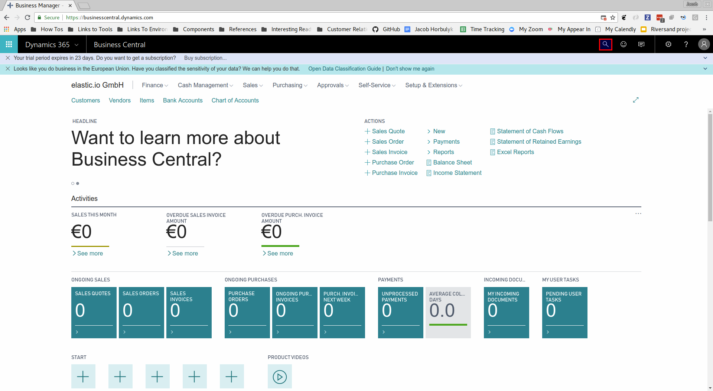

2. Search for `Users` in the search bar and select the result for users.

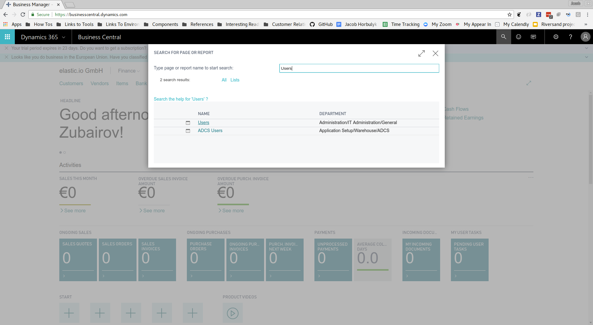

3. Select the user you wish to edit.

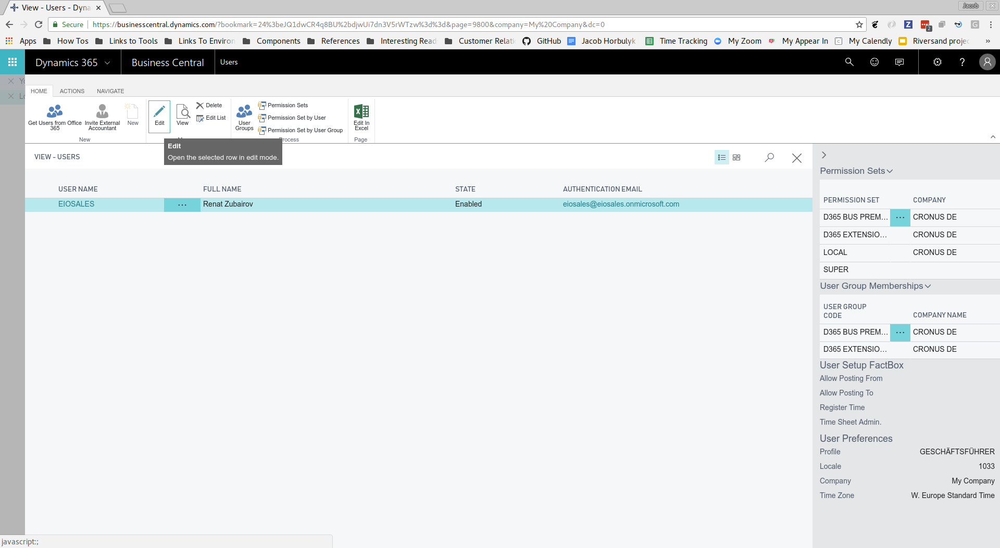

4. Click `Change Web Service Key` on the page for that user.

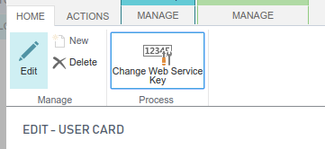

5. In the popup which appears, select the box for `Key Never Expires` and click `OK`.

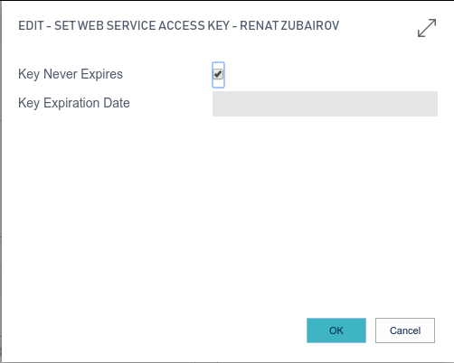

6. Click `Yes` to confirm changing the key.

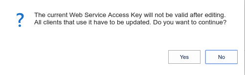

7. Note the values for `User Name` and `Web Services Access Key`.  These will
become the username and password for HTTP Basic Authentication.

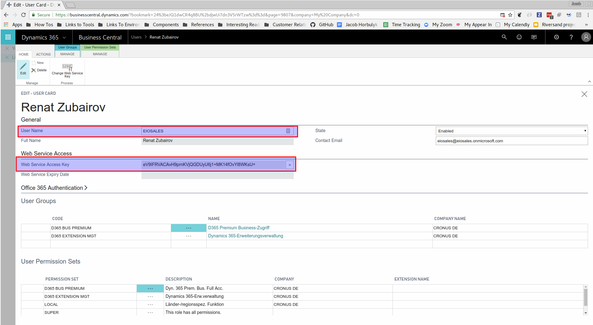

8. Search for `Web Services` in from the search and select the result.

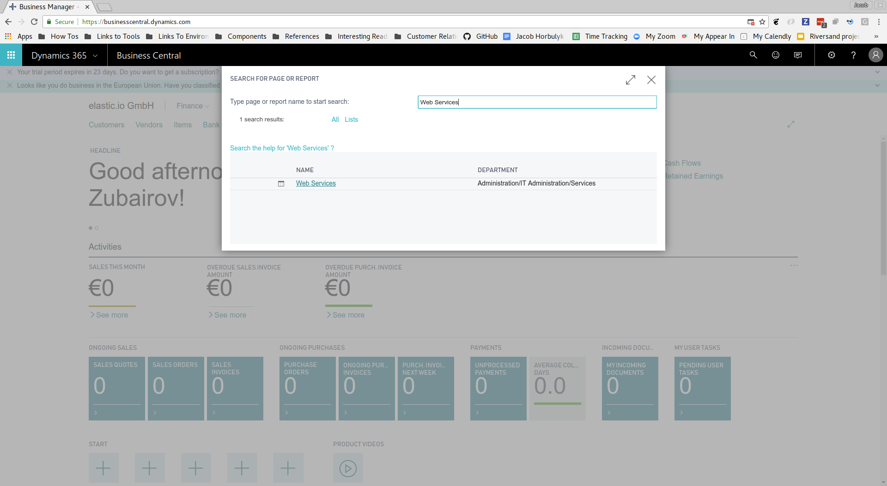

9. Copy the `ODATA V4 URL` for the Page or Query you would like to interact
with.  This will act as the OData base URL.  On some instances, it may be
possible to interact with all published objects from
`https://<instanceurl>:7048/nav/odatav4` or
`https://<instanceurl>:7048/nav/odatav4/Company('My%20Company')`.

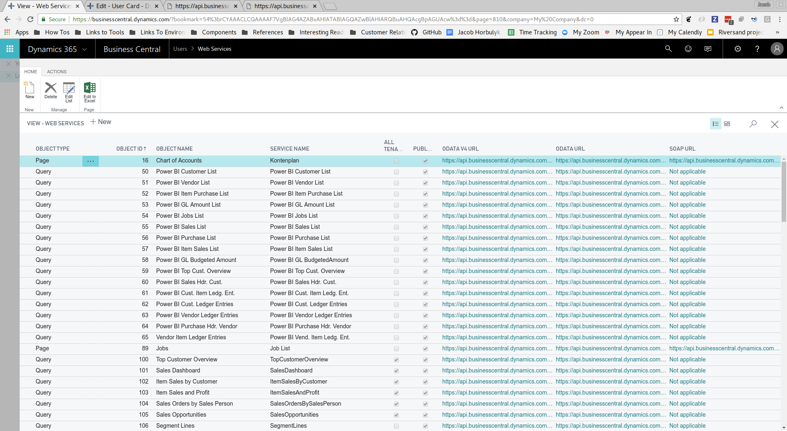

## Test Instance Set Up
All options listed below result in instances where authentication can not be
done via Active Directory.  So far, we have not been able to configure a test
instance in which authentication can be done by Active Directory.  It is unknown
whether there exist instances, where this is required.

### Using Cloud Trial Instance
A trial instance of Business Central can be requested from
https://trials.dynamics.com/ and selecting `Business Central`.  Sometimes this
trial expires or otherwise shuts down.  If this occurs, the below steps can be
followed to re-create it:

1. Visit https://trials.dynamics.com/
2. Select:
   * App type: `Business Central`
   * Work email: (for elastic.io `eiosales@eiosales.onmicrosoft.com`)
   * Phone number: (for elastic.io `0228 53444221`)

3. Click `Get Started`.
4. You should get a message saying that you already have an account.  Sign in if
necessary.
5. You will get a message saying you already have a Dynamics 365 license.
8. You should now be able to visit https://businesscentral.dynamics.com/ and
interact with our test instance.

### Using A Docker Image
The artifacts used to build and configure a NAV docker image are checked into GitHub in the following repos:
* [NAV ARM Templates](https://github.com/Microsoft/nav-arm-templates)
* [NAV Docker](https://github.com/Microsoft/nav-docker)
* [NAV Container Helper](https://github.com/Microsoft/navcontainerhelper/)

If you need assistance, opening a GitHub Issue in one of the above repos has
been effective from past experience as GitHub user @freddydk is pretty active at
answering questions.  He is a a tech evangelist at Microsoft Denmark who
[publishes a useful blog on NAV
development](https://blogs.msdn.microsoft.com/freddyk/).

[So far, it appears as though not even the evangelist has configured an image to
authenticate with
OAuth.](https://github.com/Microsoft/navcontainerhelper/issues/151)

#### Install from ARM template
Assuming that you have access to a Microsoft Azure account, there exists an
Azure Resorce Manager template which can be used to provision a VM on Azure and
install the docker image in the VM.

The ARM template can be triggered [here](http://aka.ms/getnav).
Some notes about the options I selected for my last creation:
* Used Pay-As-You-Go for subscription
* I created a new resource group for my artifacts to live in `NAV-Docker-Resource-Group`.
* Location is West US 2
* VM Name: `nav-docker-vm`
* Timezone ID: GMT
* Say yes to accepting the Eula
* Select `*` for remote desktop access IP
* Default VM Size
* `vmadmin` and `navadmin` for usernames
* Use `microsoft/bcsandbox` for NAV Docker Image
* Leave License File URI blank
* `Click Once`: Yes, not sure what this is.
* Enable Task Scheduler: Yes
* Office 365 Username/Password & Create AAD Users: If we enter our MS login
credentials there, then this should at least replicate users from AAD to the NAV
instance.  However, when I attempted this, I received the following error: `The
specified authentication email address 'eiosales@eiosales.onmicrosoft.com' is
already being used by another user. You must specify a unique email address.`
* Run Windows Update: yes
* Contact EMail for Lets Encrypt: enter your email.  If you leave this blank,
the resulting VM will use only self-signed SSL certificates and all your dev
tools will hate you.  [Enter a value for this step to have proper SSL
certificates](https://github.com/Microsoft/nav-arm-templates/issues/58).
* Auto shutdown is enabled for 8 pm.  This means that someone will have to start
the VM through portal.azure.com in order to wake the machine up.

Currently, an image created with the above credentials lives at 

#### Manually Configure
I had less success to get this working but here are some notes for various parts.

* [Installing Docker on Windows Server 2016](https://store.docker.com/editions/enterprise/docker-ee-server-windows)
* [How to use the desktopless environment of Windows Server](https://blogs.msdn.microsoft.com/freddyk/2017/11/01/1709-and-nav-on-docker/)
* [PowerShell Script to fetch Docker image, bind Docker image to host ports and
create new user on image](./CodeSnippets/CreateBCSandbox.ps1) (Make sure to
run as admin. There may be problems if you use a password that is too long
(e.g. longer than 16 chars.))
* This will create the following items on the desktop of the VM:
  * DevBC Command Prompt: When clicked, this appears to open a command prompt in the created docker image.
  * DevBC PowerShell Prompt: Same as above except with PowerShell.
  * DevBC CSIDE:  is the NAV Development environment.  Running it causes an error because MSVCR120.dll is missing.
  * DevBC Web Client: Opens a web browser that tries to connect to the docker image.
  * DevBC Windows Client: When run I get a message stating that "The program could not create a connection to the server."  It should be non Web-Browser access.
* Firewall ports may need to be opened in AWS.

## Notes on Navigating the UI

* A list of fields on all objects can be obtained by visiting http://devbc/nav/?table=2000000041
* In NAV every entity which needs to be accessible via webservice fist, may need to be published: https://docs.microsoft.com/en-us/dynamics-nav/how-to--publish-a-web-service
* KB article on enabling APIs: https://docs.microsoft.com/en-us/dynamics-nav/enabling-apis-for-dynamics-nav
* Before you can create objects, you need to define and configure the rules for ID generation: https://docs.microsoft.com/en-us/dynamics-nav-app/ui-create-number-series
